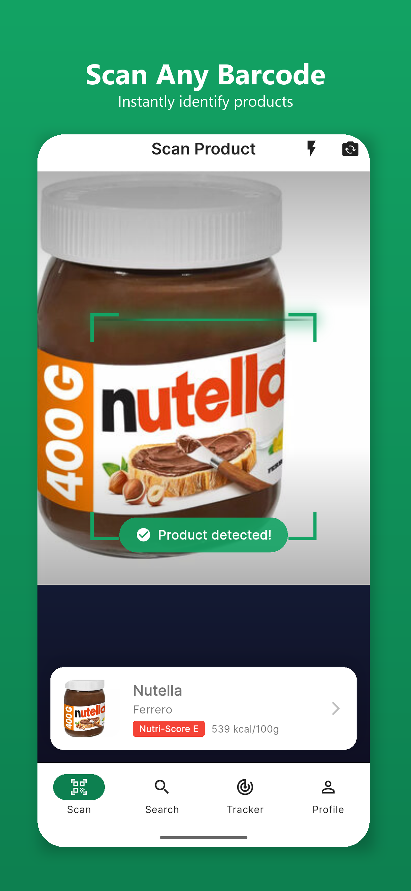
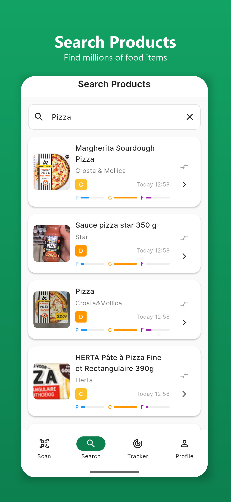
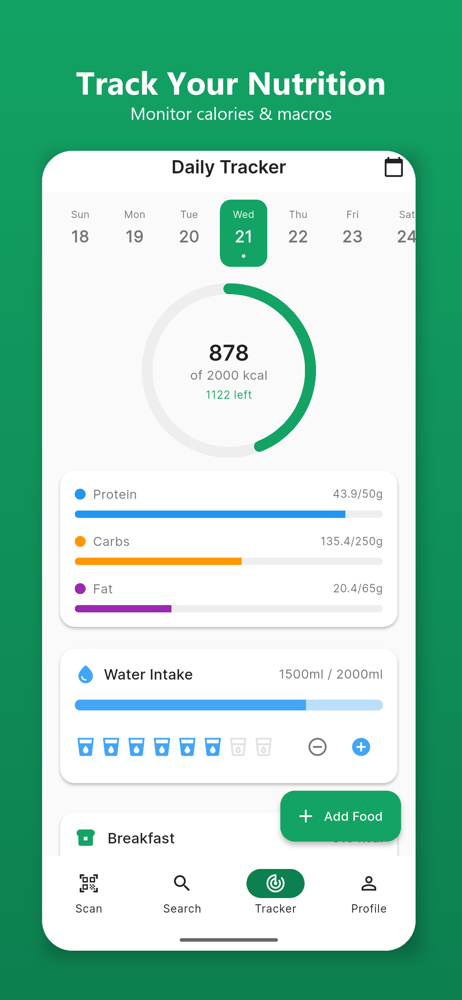
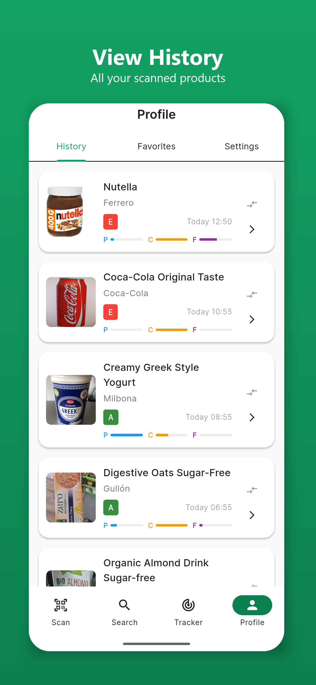
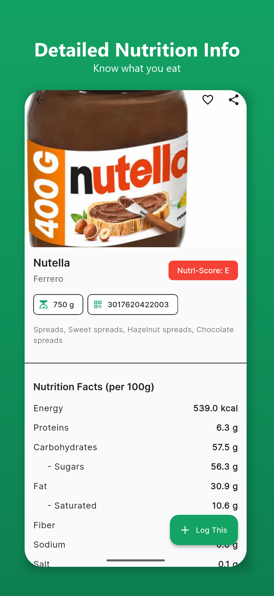
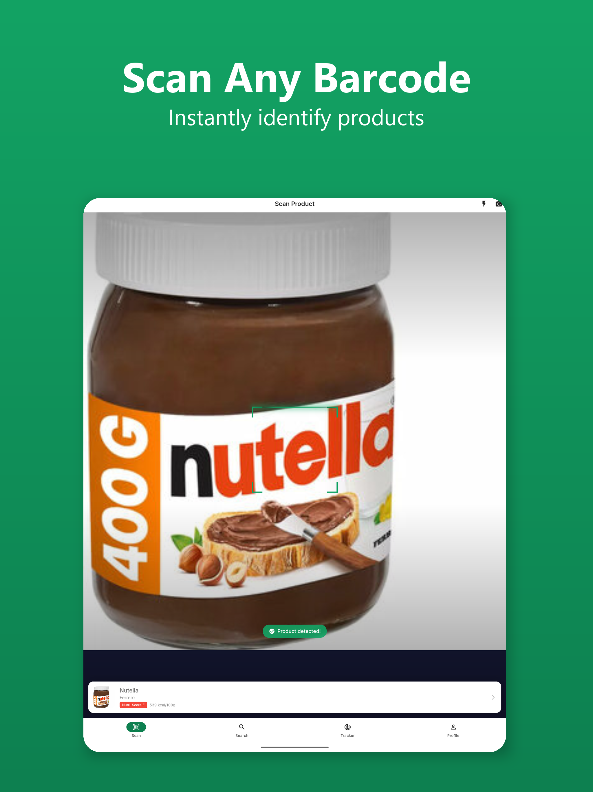
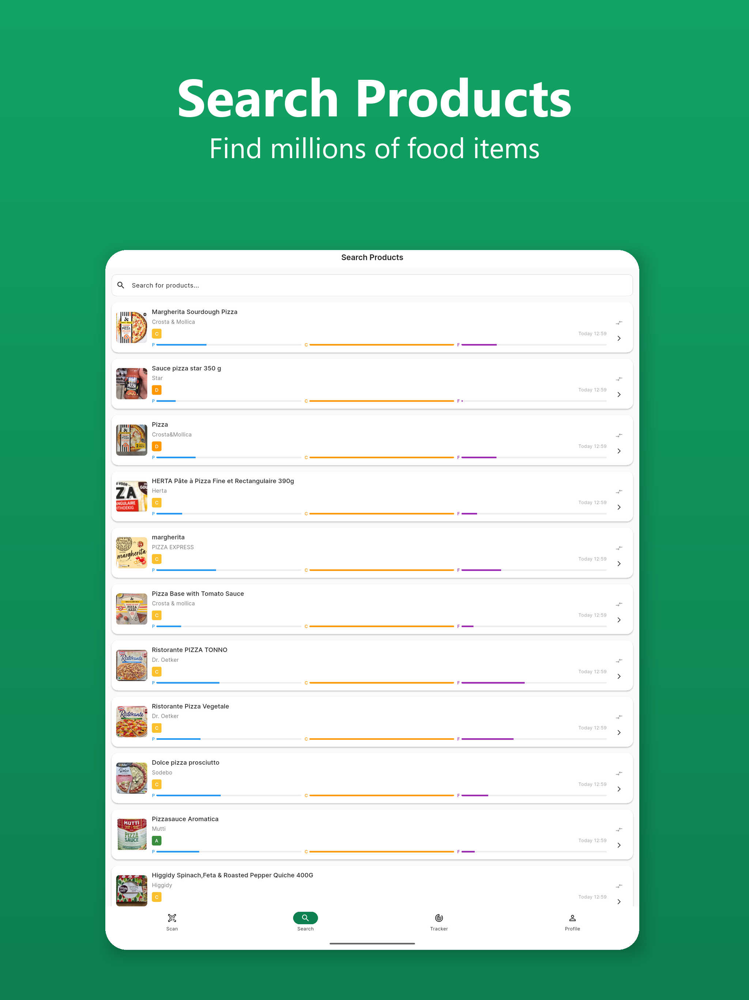
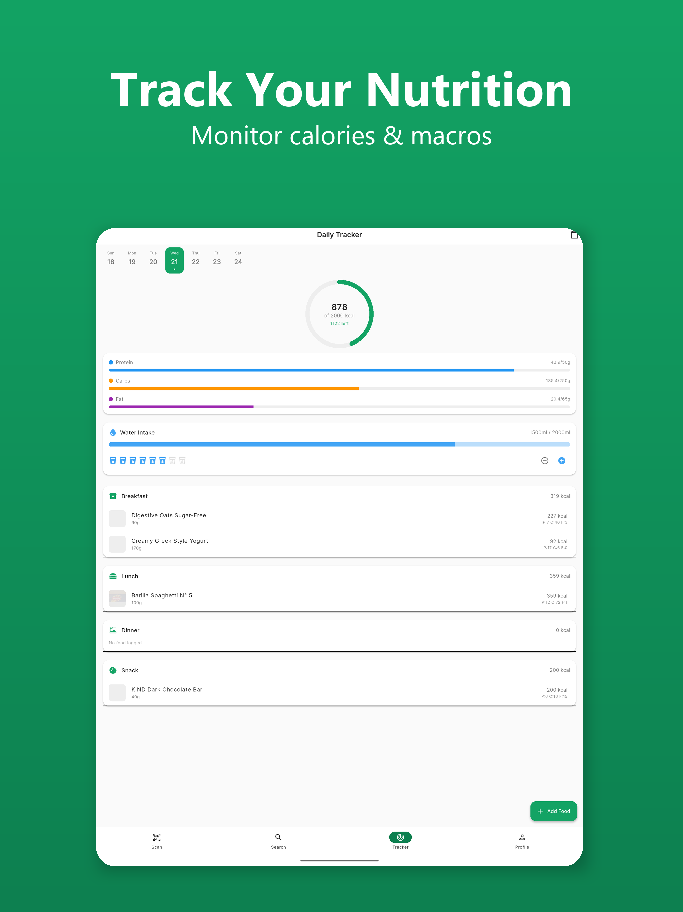
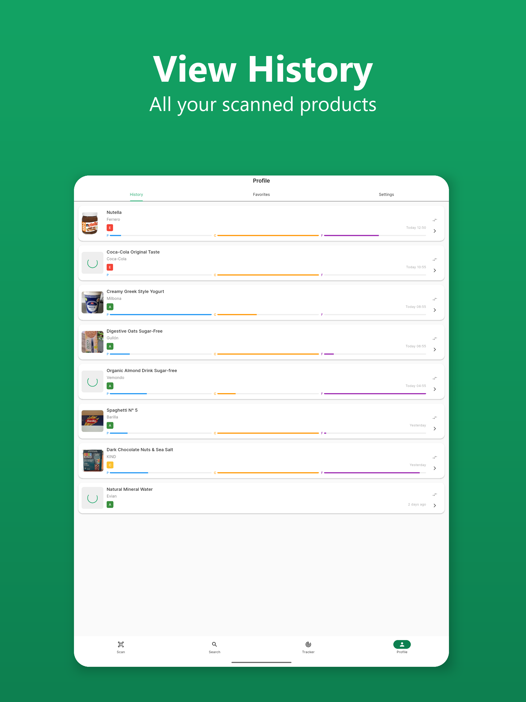
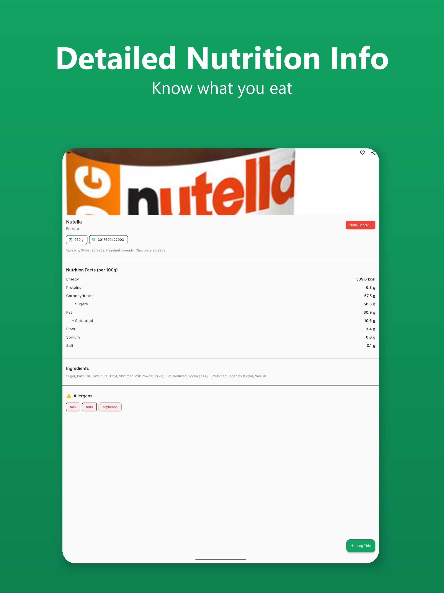

# NutriLens Pro

**Scan. Know. Choose Better.**

A professional Flutter food scanner app that retrieves detailed nutrition and product information using barcode scanning.

## Screenshots

### iPhone
<p align="center">
  
  
  
  
</p>
<p align="center">
  
</p>

### iPad
<p align="center">
  
  
</p>
<p align="center">
  
  
</p>
<p align="center">
  
</p>

## Features

### Core Features
- **Barcode Scanning** - Camera-based barcode scanning with mobile_scanner
- **Product Information** - Detailed nutrition facts, ingredients, allergens
- **Nutri-Score** - Visual nutrition grade from A to E
- **Daily Tracker** - Track your daily nutritional intake
- **Search** - Find products by name or category
- **Product Comparison** - Compare nutrition between products
- **User Profile** - Set and track personalized nutrition goals
- **Themes** - Light and dark mode support
- **Offline Cache** - Recent scans available offline
- **Share** - Share product information

### Monetization
- **Google AdMob** - Banner and interstitial ads

### Data Source
- **Open Food Facts API** - Free, open-source food database with millions of products
- **Real-time Data** - Up-to-date product information

## Architecture

```
nutrilens_pro/
├── lib/
│   ├── main.dart
│   ├── core/
│   │   ├── constants/
│   │   ├── theme/
│   │   │   └── app_theme.dart
│   │   └── utils/
│   ├── models/
│   │   ├── product_model.dart
│   │   ├── daily_log_model.dart
│   │   └── user_profile_model.dart
│   ├── providers/
│   │   ├── comparison_provider.dart
│   │   ├── daily_tracker_provider.dart
│   │   ├── search_provider.dart
│   │   └── user_profile_provider.dart
│   ├── services/
│   │   ├── api_service.dart
│   │   ├── storage_service.dart
│   │   ├── ad_service.dart
│   │   └── demo_data_service.dart
│   ├── screens/
│   │   ├── splash_screen.dart
│   │   ├── onboarding_screen.dart
│   │   ├── demo_home_screen.dart
│   │   ├── demo_scanner_screen.dart
│   │   ├── product_detail_screen.dart
│   │   ├── search_screen.dart
│   │   ├── tracker_screen.dart
│   │   ├── compare_screen.dart
│   │   └── profile_screen.dart
│   └── widgets/
│       ├── product_card.dart
│       ├── log_food_sheet.dart
│       └── nutrition_progress.dart
└── assets/
    └── demo_images/
```

## Getting Started

### Prerequisites

- Flutter SDK (>=3.0.0)
- Dart SDK (>=3.0.0)
- Android Studio / VS Code
- Xcode (for iOS)

### Installation

1. **Clone the repository**
```bash
git clone https://github.com/modexanderson/nutrilens_pro.git
cd nutrilens_pro
```

2. **Install dependencies**
```bash
flutter pub get
```

3. **Generate code**
```bash
flutter pub run build_runner build --delete-conflicting-outputs
```

4. **Run the app**
```bash
flutter run
```

## Configuration

### 1. Google AdMob Setup

#### Android

1. Add your AdMob App ID in `android/app/src/main/AndroidManifest.xml`:
```xml
<manifest>
    <application>
        <meta-data
            android:name="com.google.android.gms.ads.APPLICATION_ID"
            android:value="ca-app-pub-XXXXXXXXXXXXXXXX~YYYYYYYYYY"/>
    </application>
</manifest>
```

2. Update Ad Unit IDs in `lib/services/ad_service.dart`:
```dart
static String get bannerAdUnitId {
  if (Platform.isAndroid) {
    return 'ca-app-pub-XXXXXXXXXXXXXXXX/YYYYYYYYYY'; // Your banner ID
  }
  // ...
}
```

#### iOS

1. Add AdMob App ID in `ios/Runner/Info.plist`:
```xml
<key>GADApplicationIdentifier</key>
<string>ca-app-pub-XXXXXXXXXXXXXXXX~YYYYYYYYYY</string>
```

2. Add App Tracking Transparency:
```xml
<key>NSUserTrackingUsageDescription</key>
<string>This identifier will be used to deliver personalized ads to you.</string>
```

**Get your AdMob IDs:** https://apps.admob.com/

### 2. Permissions

#### Android (`android/app/src/main/AndroidManifest.xml`)
```xml
<uses-permission android:name="android.permission.CAMERA" />
<uses-permission android:name="android.permission.INTERNET" />
```

#### iOS (`ios/Runner/Info.plist`)
```xml
<key>NSCameraUsageDescription</key>
<string>We need camera access to scan product barcodes</string>
```

## API Integration

The app uses **Open Food Facts API** - a free, open-source food database.

### API Endpoints

**Get Product by Barcode:**
```
GET https://world.openfoodfacts.org/api/v2/product/{barcode}
```

**Search Products:**
```
GET https://world.openfoodfacts.org/cgi/search.pl?search_terms={query}&json=true
```

### Example Response
```json
{
  "status": 1,
  "product": {
    "code": "3017620422003",
    "product_name": "Nutella",
    "brands": "Ferrero",
    "nutriments": {
      "energy-kcal_100g": 539,
      "proteins_100g": 6.3,
      "carbohydrates_100g": 57,
      "sugars_100g": 56,
      "fat_100g": 31
    },
    "nutriscore_grade": "e",
    "ingredients_text": "Sugar, Palm Oil, Hazelnuts...",
    "allergens_tags": ["en:nuts", "en:milk"]
  }
}
```

**API Documentation:** https://world.openfoodfacts.org/data

## App Icon & Branding

### App Icon
Create app icons using Flutter Launcher Icons package:

1. Add your icon image to `assets/icons/app_icon.png` (1024x1024)
2. Run:
```bash
flutter pub run flutter_launcher_icons
```

### Splash Screen
The splash screen is defined in `lib/screens/splash_screen.dart`. Customize colors and logo as needed.

## Building for Release

### Android

1. **Create a keystore:**
```bash
keytool -genkey -v -keystore ~/nutrilens-key.jks -keyalg RSA -keysize 2048 -validity 10000 -alias nutrilens
```

2. **Create `android/key.properties`:**
```properties
storePassword=your_password
keyPassword=your_password
keyAlias=nutrilens
storeFile=/path/to/nutrilens-key.jks
```

3. **Update `android/app/build.gradle`:**
```gradle
android {
    signingConfigs {
        release {
            keyAlias keystoreProperties['keyAlias']
            keyPassword keystoreProperties['keyPassword']
            storeFile keystoreProperties['storeFile'] ? file(keystoreProperties['storeFile']) : null
            storePassword keystoreProperties['storePassword']
        }
    }
    buildTypes {
        release {
            signingConfig signingConfigs.release
        }
    }
}
```

4. **Build APK/AAB:**
```bash
flutter build apk --release
# or
flutter build appbundle --release
```

### iOS

1. **Open Xcode:**
```bash
open ios/Runner.xcworkspace
```

2. **Configure signing** in Xcode with your Apple Developer account

3. **Build IPA:**
```bash
flutter build ipa --release
```

## Testing

```bash
# Run tests
flutter test

# Run with coverage
flutter test --coverage

# Integration tests
flutter drive --target=test_driver/app.dart
```

## License

This project is licensed under the MIT License - see the LICENSE file for details.

## Contributing

Contributions are welcome! Please feel free to submit a Pull Request.

## Support

For support, email support@nutrilenspro.com or open an issue on GitHub.

## Acknowledgments

- **Open Food Facts** - For providing the free food database API
- **Flutter Community** - For amazing packages and support
- **Contributors** - Thank you to all who have contributed!

## App Store Submission Checklist

### Before Submission

- [ ] Test on real devices (Android & iOS)
- [ ] Replace test AdMob IDs with production IDs
- [ ] Add Privacy Policy URL
- [ ] Add Terms of Service URL
- [ ] Create App Store screenshots (multiple device sizes)
- [ ] Write compelling app description
- [ ] Prepare promotional graphics
- [ ] Test all features thoroughly
- [ ] Check for crashes and bugs
- [ ] Verify API key limits and quotas
- [ ] Review app permissions usage

### Google Play Requirements

- App must target Android API 33+
- Provide data safety information
- Complete store listing
- Upload APK/AAB with proper versioning

### App Store Requirements

- App must support iOS 12.0+
- Provide privacy policy
- Complete App Store listing
- Submit for review

## Future Enhancements

- [ ] Nutrition goal tracking
- [ ] Alternative product suggestions
- [ ] Food diary/meal logging
- [ ] Barcode history export
- [ ] Multiple language support
- [ ] Allergy warnings & filters
- [ ] Custom product database
- [ ] Social features & sharing
- [ ] Widget support
- [ ] Apple Watch companion app

---

**NutriLens Pro - Scan. Know. Choose Better.**
